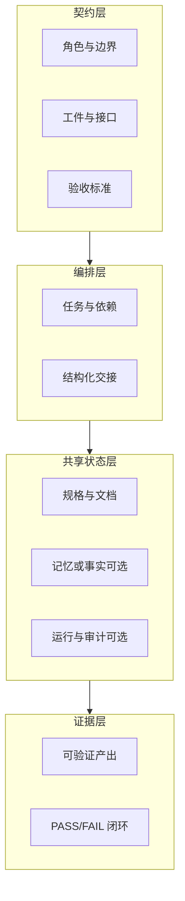

# ADS 总览

## 名称

- **中文**：Agent 开发规范  
- **英文**：**Agent Development Specification**  
- **缩写**：**ADS**

## 要解决什么问题

多 Agent、多工具链并行时，常见失败模式包括：

- **上下文在交接中丢失**（换会话、换 CLI 后重复踩坑）
- **同一文件被多人/多 Agent 并行修改**（冲突与返工）
- **「完成」无验收、无证据**（无法审计、难以复盘）
- **技能与工具锁死在某一客户端**（迁移与复用成本高）

ADS 用一套**轻量、可复制**的约定，把协作拆成可执行的**契约、编排、共享状态、证据**四层，并用 **Handoff Envelope（交接信封）** 贯穿各工具。

## 核心模型：四层 + 一信封

**交接信封**最小维度（详见 `templates/handoff.md`）：

| 维度 | 作用 |
|------|------|
| Metadata | 从谁到谁、任务 ID、时间戳、优先级 |
| Context | 当前状态、相关路径、依赖与约束 |
| Request | 交付物、可勾选验收标准、参考资料 |
| Evidence expectation | 完成所需证明（命令输出、测试、截图等） |

## 与 UAW / MCP 的关系

- **UAW（统一 Agent 工作空间）**：ADS 用**目录与声明式文件**落实「工作空间」概念，见 [02-uaw-mapping.md](02-uaw-mapping.md)。
- **MCP**：作为工具侧推荐协议；ADS 不要求一上来就部署 MCP，但要求**工具 ID 与描述**在 `toolset.json` / manifest 中可发现，见 [03-tools-and-mcp.md](03-tools-and-mcp.md)。

## 如何使用本模板

1. 复制 `agent-dev-spec` 到项目根或子目录。  
2. 将根 `README.md` 作为**唯一入口**，并维护其中的 `ADS Agent Quick Start` 区块。  
3. 用 `templates/` 与 `.ai/templates/` 生成真实任务与交接文件。  
4. 按 [01-principles.md](01-principles.md) 落实单写者与 Integration 闸口。

下一篇：[01-principles.md](01-principles.md)
